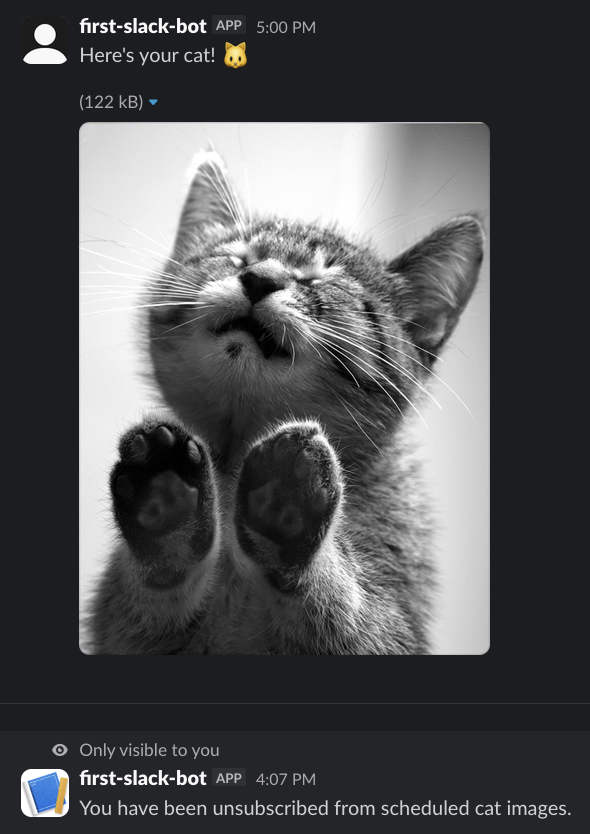

# DJshelfmushroom's slack bot
Made for stardance, powered by cuteness
<!-- corny af god damn --> 

## Try it

In the Hack Club slack workspace, join the [djb-testing](https://app.slack.com/client/E09V59WQY1E/C0BA48WFSKD) channel and run `/djb-help` for a list of commands, or see below.

## Commands

| Command | What it does |
|---|---|
| `/djb-help` | List all available commands |
| `/djb-ping` | Check bot latency |
| `/djb-catimg` | Get a random cat image |
| `/djb-catfact` | Get a random cat fact |
| `/djb-joke` | Get a random joke |
| `/djb-subscribe` | Open a scheduler modal - pick an interval (minutes/hours/days) and a start date/time, and the bot DMs you a cat image on that schedule |
| `/djb-unsubscribe` | Stop your scheduled cat images |

Here's a scheduled cat image, followed by me unsubscribing:

## Features

- Random cat images from [The Cat API](https://thecatapi.com/)
- Cat facts from [catfact.ninja](https://catfact.ninja/) and jokes from the [Official Joke API](https://official-joke-api.appspot.com/)
- Recurring cat-image subscriptions with a Block Kit modal (number + interval + start time)
- Timezone-aware scheduling - converts your Slack profile timezone to UTC so deliveries land when you expect
- Subscriptions persist across restarts (`subscribers.json`)
- Runs over Socket Mode - no public URL or webhook setup needed

## Required permissions / scopes

**Bot token scopes (OAuth & Permissions):**

- `commands` - slash commands
- `chat:write` - send messages in channels
- `im:write` - send DMs to users
- `users:read` - read the subscriber's timezone for scheduling

**App-level token:**

- `connections:write` - required for Socket Mode

## How scheduling works

A [node-cron](https://github.com/node-cron/node-cron) task fires every minute and compares the current time against each subscriber's `nextScheduledTime` (stored in `subscribers.json`). When they match, the bot DMs a cat image and advances the timestamp by the chosen interval. This keeps the bot dependency-free and (somewhat) restart-safe - the tradeoff is delivery resolution of one minute, which is plenty for cat pictures.

## AI use disclosure

Parts of this README were drafted with Claude Code, then reviewed and edited by hand. Claude code and Github Copilot were used for debugging and ideation, but all code is written by hand.

## Credits

- Built with [Bolt for JavaScript](https://slack.dev/bolt-js/)
- Cat images: [The Cat API](https://thecatapi.com/) · Cat facts: [catfact.ninja](https://catfact.ninja/) · Jokes: [Official Joke API](https://github.com/15Dkatz/official_joke_api)
- Made for [Hack Club Stardance](https://stardance.hackclub.com/)
